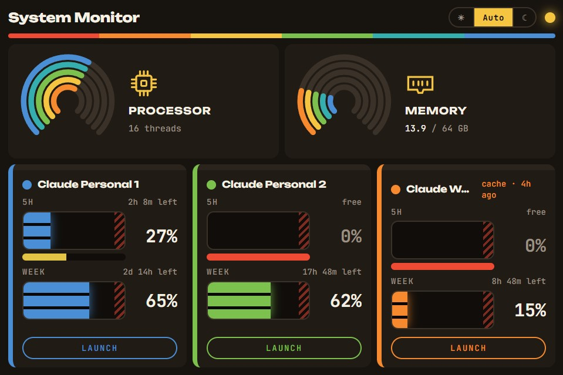
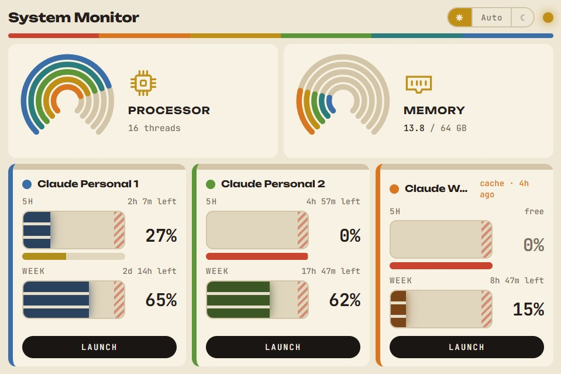

# Rainbow Claude Monitor

Маленькая локальная веб-панель для второго монитора: нагрузка ПК и живые статусы
всех ваших аккаунтов Claude Code на одном экране.



<details>
<summary>Та же панель днём</summary>



</details>

Одна и та же панель ночью и днём: тема не переключается щелчком, а плавно
переезжает вместе с закатом в вашем городе.

## Зачем это нужно

Если у вас несколько аккаунтов Claude (личный, второй личный, рабочий), то
единственный способ узнать, где ещё остался лимит, — открыть окно и набрать
`/status`. А когда окон четыре и все чем-то заняты, непонятно даже, кто из них
сейчас думает, а кто уже ждёт вашего ответа.

Панель отвечает на эти вопросы, ничего не спрашивая:

- сколько процентов 5-часового и недельного окна съедено на **каждом** аккаунте;
- когда окно сбросится;
- какие сессии прямо сейчас **работают**, а какие **ждут ввода**;
- не задыхается ли сама машина (CPU / RAM);
- и позволяет запустить нужный аккаунт кнопкой, сразу покрасив его окно в свой цвет.

Рассчитана на то, чтобы висеть в углу дополнительного экрана и не требовать
внимания: не прокручивается, сама плавно переезжает из светлой темы в тёмную
к закату, а карточка коротко мигает в момент, когда её Claude закончил ход.

## Что умеет

| | |
|---|---|
| **Лимиты** | полосы `5H` и `WEEK` на каждый аккаунт: процент, сколько осталось до сброса (`2h 8m left`), `free` — если окно уже сброшено |
| **Свежесть данных** | если живой запрос не прошёл, на карточке видно `cache · 4h ago` — числа старые, и это не скрывается |
| **Живой статус** | видит запущенные сессии Claude Code: работает / ждёт ввода, карточка мигает, когда её Claude закончил ход |
| **Железо** | радужные дуги загрузки CPU и RAM, число потоков, занято / всего памяти |
| **Цвета** | у каждого аккаунта свой акцент из тех же девяти, что у команды `/color`; клик по кружку меняет |
| **Launch** | кнопка запускает ярлык аккаунта, отвечает на вопрос «доверяете ли папке» и красит окно |
| **Темы** | светлая / авто / тёмная; в авто — плавный дрейф по восходу и закату для ваших координат |
| **Ноль зависимостей** | Windows PowerShell 5.1 + браузер. Ни Node, ни Python, ни установки |
| **Локально** | слушает только `127.0.0.1`, наружу не смотрит, ничего не собирает |

## Требования

- Windows 10/11, Windows PowerShell 5.1 (стоит из коробки);
- Claude Code, установленный хотя бы для одного аккаунта;
- браузер.

Права администратора не нужны: префикс `127.0.0.1` не занят системой.

---

## Способ 1: просто попросите своего Клода всё настроить

Самый быстрый путь. Склонируйте репозиторий, откройте в его папке Claude Code
и скажите примерно так:

> Прочитай README.md и PROJECT.md в этой папке. Найди все мои аккаунты Claude
> Code на этой машине (каталоги вида `~/.claude*`, ярлыки и .exe-лаунчеры на
> рабочем столе и в `%USERPROFILE%`), составь под них `config.json` по образцу
> `config.example.json`, подставь мои координаты для темы (город — Киев),
> раздай аккаунтам разные цвета, запусти сервер и проверь, что панель
> открывается и лимиты по всем аккаунтам показываются. Если какой-то аккаунт
> отдаёт кэш вместо живых данных — скажи, почему, посмотрев `/api/debug`.

Он сам разложит каталоги по `accounts[]`, поставит порт, тему и координаты,
запустит `server.ps1` и покажет, что получилось. Дальше можно просить его же:
«добавь четвёртый аккаунт», «поставь порт 9000», «сделай тему всегда тёмной»,
«положи ярлык в автозагрузку».

---

## Способ 2: настроить руками

### Быстрый старт

```powershell
git clone <репозиторий> "System Monitor"
cd "System Monitor"
powershell -ExecutionPolicy Bypass -File server.ps1
```

При первом запуске `config.json` создаётся сам — с одним аккаунтом, смотрящим в
`~/.claude`. Панель откроется на <http://127.0.0.1:8777>.

Дальше правите `config.json` под себя и перезапускаете сервер. Полный образец со
всеми ключами и пояснениями — `config.example.json`.

### Аккаунты

Главное, что нужно настроить, — блок `accounts[]`. Одна запись на аккаунт:

```json
{
  "id": "personal1",
  "label": "Claude Personal 1",
  "configDir": ".claude_personal",
  "launcher": "Claude Personal 1.exe",
  "workingDir": "C:\\Projects",
  "accent": "blue"
}
```

| Поле | Обязательно | Что это |
|---|---|---|
| `id` | да | короткий уникальный слаг, используется в API |
| `configDir` | да | `CLAUDE_CONFIG_DIR` аккаунта: абсолютный путь или относительный от `%USERPROFILE%` |
| `label` | нет | подпись на карточке |
| `launcher` | нет | .exe или ярлык для кнопки Launch: абсолютный путь либо имя, которое ищется на рабочем столе, в `%USERPROFILE%` и в `PATH`. Без него карточка просто без кнопки |
| `launchArgs` | нет | массив аргументов запуска |
| `workingDir` | нет | папка, в которой откроется окно; по умолчанию `%USERPROFILE%` |
| `accent` | нет | цвет окна: `red orange yellow green cyan blue purple pink default` |

**Где взять `configDir`.** Если аккаунт один — это `.claude`. Если несколько, их
разводит переменная `CLAUDE_CONFIG_DIR` в ярлыке запуска; посмотрите, какие
каталоги есть:

```powershell
Get-ChildItem $env:USERPROFILE -Directory -Filter ".claude*" | Select-Object Name
```

Настоящий каталог аккаунта содержит `.credentials.json` и `.claude.json`.

### Остальные настройки

| Ключ | По умолчанию | Что делает |
|---|---|---|
| `title` | `Rainbow Claude Monitor` | заголовок вкладки и шапки |
| `port` | `8777` | локальный порт |
| `openBrowser` | `true` | открывать браузер при старте сервера |
| `location` | Киев | координаты для восхода/заката; `null` — откат на 06:00 / 21:00 |
| `ui.columns` | `"auto"` | карточек в ряд: число или `auto` (1–3 → один ряд, 4+ → по трое) |
| `ui.theme` | `"auto"` | стартовая тема: `light`, `dark`, `auto`. Тумблер в шапке перекрывает и запоминается в браузере |
| `ui.duskMinutes` | `45` | длина растяжки между дневной и ночной палитрой вокруг заката |
| `ui.refreshMs` | `1000` | как часто страница ходит за свежими числами |
| `ui.showMachine` | `true` | показывать ряд CPU / RAM |
| `ui.showSevenDay` | `true` | показывать недельную полосу |
| `ui.hotPercent` | `90` | процент, с которого полоса краснеет |
| `ui.accents` | `{}` | свои RGB для девяти имён: `{ "blue": { "day": [58,110,168], "night": [74,142,214] } }` |
| `usage.source` | `"auto"` | `auto` — живой запрос с откатом на кэш; `api` — только живой; `cache` — не выходить в сеть |
| `usage.liveOkSec` | `120` | пауза между живыми опросами здорового аккаунта |
| `usage.liveBadSec` | `600` | пауза после ошибки |
| `launch.autoColor` | `true` | красить окно после запуска |
| `launch.trustPromptKeys` | `"down,enter"` | клавиши в ответ на «Do you trust this folder?»; `""` — не отвечать |
| `launch.waitSec` | `90` | сколько ждать появления запущенного окна |

Аргументы командной строки перекрывают конфиг на один запуск — удобно для второй
копии панели:

```powershell
powershell -ExecutionPolicy Bypass -File server.ps1 -Port 8778 -NoBrowser
```

### Запуск и автозагрузка

`Rainbow Claude Monitor.bat` стартует сервер свёрнутым; браузер открывает сам
сервер, если `openBrowser: true`. Чтобы панель поднималась при входе в систему,
положите ярлык на этот .bat в автозагрузку:

```powershell
explorer shell:startup
```

---

## Как это устроено

| Файл | Роль |
|---|---|
| `server.ps1` | HTTP-сервер на `HttpListener`: отдаёт страницу и JSON, ходит за лимитами |
| `index.html` | вся морда: шкалы, карточки, темы, цвета |
| `config.json` | ваши настройки (в git не попадает) |
| `config.example.json` | образец со всеми ключами и комментариями |
| `Rainbow Claude Monitor.bat` | запуск свёрнутым, годится для автозагрузки |
| `poke.ps1` | пишет текст и клавиши в консоль чужого процесса (`WriteConsoleInput`) |
| `launch-color.ps1` | дожидается только что открытого окна, отвечает на вопрос о доверии, просит покрасить |
| `colors.json` | текущий цвет каждого аккаунта (состояние, в git не попадает) |
| `PROJECT.md` | подробный разбор: почему сделано именно так |

**Откуда берутся лимиты.** Основной источник — `GET
https://api.anthropic.com/api/oauth/usage` с OAuth-токеном аккаунта. Токен
читается из `<configDir>/.credentials.json` в момент запроса, никуда не
сохраняется и не логируется. Запасной — `cachedUsageUtilization` в
`<configDir>/.claude.json`; его обновляет только сам Claude Code при `/status`,
поэтому он часто устаревает, и карточка тогда подписана «кэш · N назад».

**Откуда статус сессий.** `<configDir>/sessions/<pid>.json` — реестр, который
ведёт сам Claude Code. Сессия считается живой, только если её pid ещё есть в
процессах, а запись моложе 12 часов.

**Почему цвет хранит панель, а не Claude.** Команда `/color` меняет цвет только
в памяти запущенного окна и никуда его не пишет — ни в `settings.json`, ни в
`sessions/*.json`. Поэтому выбор лежит в `colors.json`, а панель шлёт `/color`
в конкретное окно по pid.

Подробности каждого решения — в `PROJECT.md`.

## API

- `GET /` — страница
- `GET /api/config` — блок `ui` для клиента
- `GET /api/stats` — `{ cpu, ram, host, accounts[] }`, у аккаунта есть `source: api|cache`
- `GET /api/debug` — что вернул живой опрос лимитов (коды и ошибки, без токенов)
- `POST /api/refresh` — сбросить кэш живого опроса
- `POST /api/color?id=&name=[&pid=]` — покрасить окна аккаунта
- `POST /api/launch?id=` — запустить лаунчер аккаунта

## Приватность

Сервер слушает только `127.0.0.1`, а наружу ходит единственным адресом —
`api.anthropic.com` за вашими же лимитами (плюс раз в сутки за временем заката).
OAuth-токены читаются на лету и не попадают ни в логи, ни в `/api/debug`, ни на
страницу. `config.json` и `colors.json` исключены из git, чтобы пути и раскладка
ваших аккаунтов не уехали в репозиторий.

## Оговорки

- `/api/oauth/usage` — внутренняя ручка Claude Code, не публичный API: может
  измениться без предупреждения. Любая ошибка тихо роняет аккаунт на кэш,
  панель продолжает работать, причина видна в `/api/debug`.
- Кнопка Launch и покраска — Windows-специфичные: они пишут в консоль чужого
  процесса через `WriteConsoleInput`.
- Если панель запущена изнутри самого Claude Code, сервер вычищает из своего
  окружения все `CLAUDE*`, `AI_AGENT`, `NO_COLOR` — иначе новое окно унаследует
  чужой аккаунт и не покрасится.

## Идеи на потом

- GPU через `nvidia-smi`
- звук или уведомление при переходе лимита за 90 %
- обновление токена по `refresh_token`, когда access протухнет
